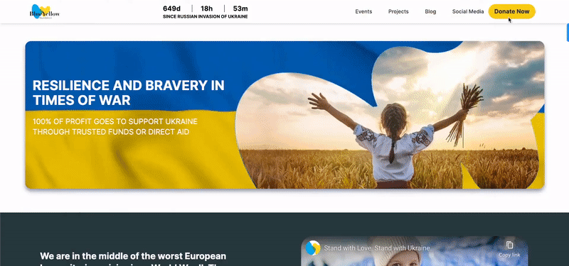
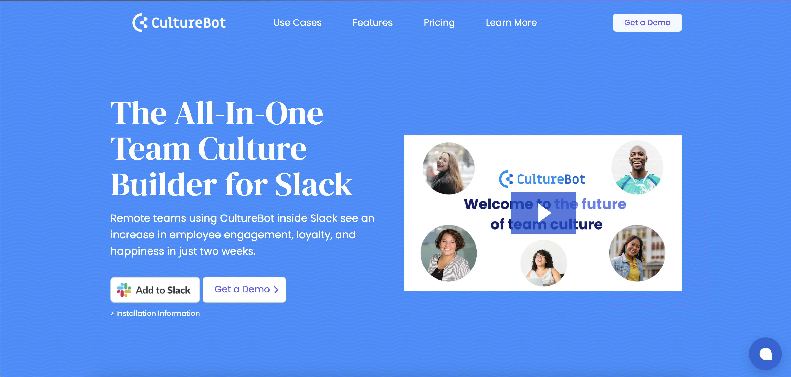
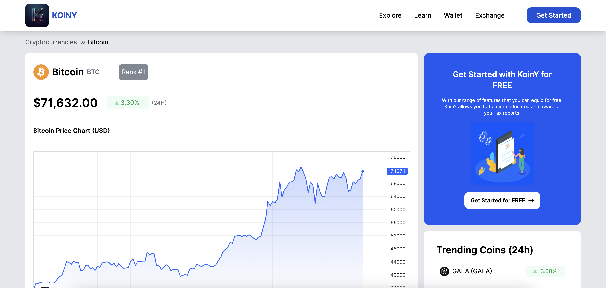
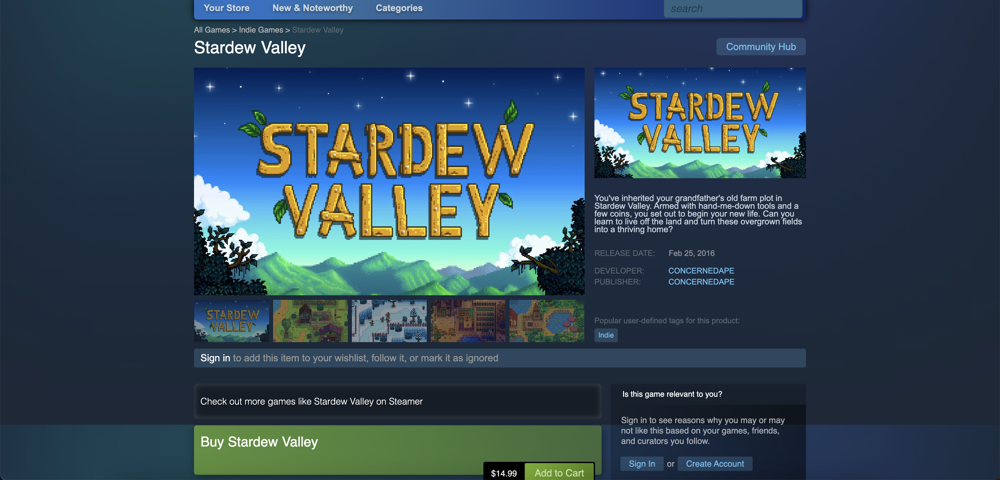

 

<h3 align="left">Hey there! I'm Anton, a passioned Software Engineer. My go-to stack includes:
<b>JavaScript</b> | 
<b>React</b> | 
<b>Next.js</b> | 
<b>Redux</b> | 
<b>Tailwind CSS</b> |
<b>Node.js.</b>
I'm always happy to collaborate and challenge my skills 😎 Feel free to <a href="https://antonjames.dev/#contact">reach out</a> or explore my <a href="https://antonjames.dev/">portfolio</a>
</h3>

  <h1>Hobbies</h1>
  <h2>💻 Coding | ⛸️ Ice skating | 📚 Psychology | 🥾 Hiking | 🧳 Travelling</h2>
  <!-- 
 -->
  <h1>Skills</h1>
  
  

  <h1>Noteworthy Deployments</h1>

  <h2>Blue & Yellow</h2>
  
Website crafted for the Blue & Yellow Foundation aims to raise funds to aid people in Ukraine. It features a <b>responsive design</b>, <b>SEO optimization</b>, and integrates with <b>Stripe</b> for donations, <b>Eventbrite</b> for event management, and <b>Facebook</b> for news updates. The portal ensures secure administration login through <b>OAuth 2</b> technology.

  

    <a href="https://blueyellowfoundation.org/">Live Link</a>
  

   
  
  

  <h2>Culture Bot</h2>
  
CultureBot is the Slack app that designed to empower your team culture. I assisted in implementing one of its pivotal features, ensuring a dynamic and enriching experience for all users.

  

    <a href="https://getculturebot.com/">Live Link</a>
  

   
  
  

  <h2>Itinerator</h2>
  
An interactive website designed to elevate individuals' experiences by providing meaningful leisure and activity options. As a front-end lead, I developed reusable <b>React</b> components and employed modern styling techniques. I utilized <b>Redux</b> to optimize data flow, minimizing database calls for enhanced performance.

  

    <a href="https://excursionexplorer.onrender.com/">Live Link</a> ||
    <a href="https://github.com/dtannyc1/itinerator">GitHub Repo</a>
  

   
  
  

    
  <h2>KoinY</h2>
  
Cryptocurrency Trading Platform built using <b>Next.js</b> for efficient front-end rendering, offering server-side rendering and SEO advantages. Incorporated responsive design with <b>Tailwind CSS</b> to enhance UX across devices and streamline development. Spearheaded the integration of a serverless <b>PostgreSQL</b> database with Neon, resulting in cost savings. Additionally, established <b>RESTful APIs</b> following industry best practices.

  

    <a href="https://koiny.vercel.app/">Live Link</a> || 
    <a href="https://github.com/AntonJames-Sistence/KoinY">GitHub Repo</a>
  

   
  
  

  <h2>Steamer</h2>
  
Developed from the ground up in just two weeks. In this project I employed <b>Ruby on Rails</b> for the backend, coupled with <b>React</b> and <b>Redux</b> for a seamless frontend experience, all supported by <b>PostgreSQL</b> as the database.

  

    <a href="https://steamer-9bo7.onrender.com/">Live Link</a> || 
    <a href="https://github.com/AntonJames-Sistence/Steamer">GitHub Repo</a>
  

   
  
  

  <h2>Torque</h2>
  
Recreating fast-paced 80s arcade classics, I achieved smooth and challenging gameplay by crafting physics and logic entirely from scratch, employing <b>Vanilla JavaScript</b>. The vibrant and dynamic animations were realized through <b>Canvas API</b> and the application of <b>Object-Oriented Programming</b> (OOP) principles.

  

    <a href="https://antonjames-sistence.github.io/Torque/">Live Link</a> || 
    <a href="https://github.com/AntonJames-Sistence/Torque">GitHub Repo</a>
  

   
  
  

  <h1>Contacts</h1>

   &nbsp;&nbsp;&nbsp;
   &nbsp;&nbsp;&nbsp;
   &nbsp;&nbsp;&nbsp;
   &nbsp;&nbsp;&nbsp;

