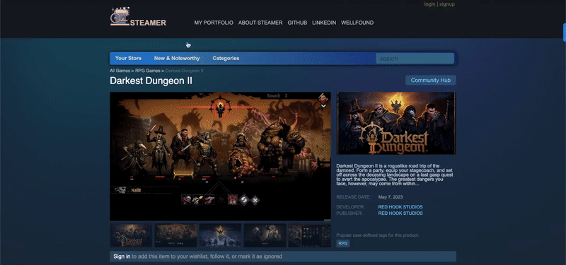

 

Seasoned Software Engineer. Skilled in technical proficiency, clear communication, and adept problem-solving.  I approach every challenge with a focus on delivering tangible results.

  <h2 style="font-size: 36px;">My Hobbies</h2>
  <h3 style="font-size: 20px;">⛸️ Ice skating | 📚 Psychology | 🥾 Hiking | 🧳 Travelling | 💻 Coding
  </h3>
<!--   
 -->
  <h2 style="font-size: 36px;">Skillset</h2>
  
  

  <h2 style="font-size: 36px;">Noteworthy Deployments | Projects</h2>

  
<a href="https://antonjames.dev/">Portfolio</a>

  
   
  <a style="font-size: 18px;" style="font-size: 18px;" href="https://antonjames.dev/">GitHub Repo</a>
  

  
<a href="https://blue-yellow-foundation.vercel.app/">Blue&Yellow</a> (Non-profit Donations Portal)

  
   
  <a style="font-size: 18px;" style="font-size: 18px;" href="https://github.com/AntonJames-Sistence/BlueYellowTeam">GitHub Repo</a>
  

  
<a href="https://excursionexplorer.onrender.com/">Itinerator</a> (Personalized Activity Recommender)

  
   
  <a style="font-size: 18px;" href="https://github.com/dtannyc1/itinerator">GitHub Repo</a>
  

  
<a href="https://steamer-9bo7.onrender.com/">Steamer</a> (Video Game Store)

  
   
  <a style="font-size: 18px;" href="https://github.com/AntonJames-Sistence/Steamer">GitHub Repo</a>
  

  
<a href="https://antonjames-sistence.github.io/Torque/">Torque</a> (Fast-paced Racing Game)

  
   
  <a style="font-size: 18px;" href="https://github.com/AntonJames-Sistence/Torque">GitHub Repo</a>
  

  <h1>Contacts</h1>

   &nbsp;&nbsp;&nbsp;
  <a href="https://www.linkedin.com/in/anton-james-ja/">
<!--      -->
    
  </a> &nbsp;&nbsp;&nbsp;
  <a href="https://wellfound.com/u/anton-james">
<!--      -->
    
  </a> &nbsp;&nbsp;&nbsp;
  <a href="mailto:anton.james.ja@gmail.com">
<!--      -->
    
  </a> &nbsp;&nbsp;&nbsp;

